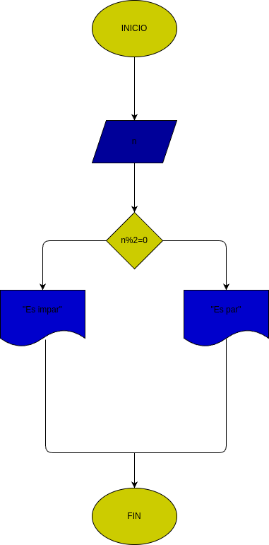

# Par_o_Impar
indica si un número es par o impar
## análisis
### input

Variables de entrada:num: el número que se probará si es par o impar

## processing
num%2=0 print("es par.") else: print("no es par.")

## output
es par / es impar

# diseño
  "diagrama de flujo"

## construcción